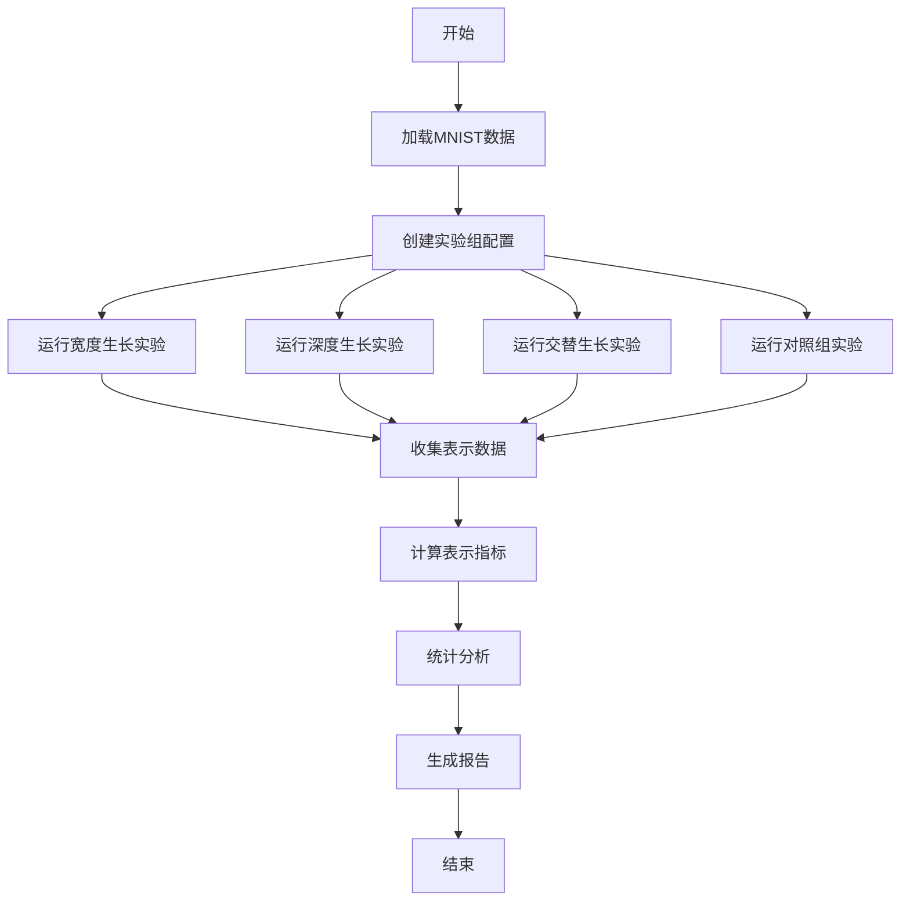

# 实验设计：生长策略比较

## 实验基本信息
- **实验名称**: 生长策略比较实验
- **实验编号**: EXP-001
- **对应研究问题**: RQ2
- **实验类型**: 对比性实验
- **创建日期**: 2026-01-30
- **预计完成**: 2026-02-02

## 实验目的

### 主要目的
比较不同生长策略（宽度生长、深度生长、交替生长）对网络表示质量的影响。

### 具体目标
1. 测量不同策略下的表示分离度变化
2. 比较不同策略的最终网络性能
3. 分析生长过程中的表示演化规律
4. 为最优生长策略选择提供依据

## 实验假设

### 研究假设
1. **H2.1**: 宽度生长比深度生长产生更高的表示分离度
2. **H2.2**: 交替生长策略在表示质量和网络性能间取得最佳平衡
3. **H2.3**: 不同策略的表示演化轨迹存在显著差异

### 零假设
1. **H0₂.₁**: 不同生长策略的表示分离度无显著差异
2. **H0₂.₂**: 不同生长策略的网络性能无显著差异
3. **H0₂.₃**: 不同策略的表示演化轨迹无显著差异

## 实验设计

### 实验变量
#### 自变量（Independent Variables）
| 变量名称 | 变量类型 | 取值/水平 | 控制方式 |
|----------|----------|-----------|----------|
| 生长策略 | 离散 | 宽度生长、深度生长、交替生长 | 固定设计 |

#### 因变量（Dependent Variables）
| 变量名称 | 测量指标 | 测量方法 | 测量频率 |
|----------|----------|----------|----------|
| 表示分离度 | 分离度分数 | 生长平台metrics模块 | 每个生长阶段 |
| SVM准确率 | 交叉验证准确率 | sklearn SVM | 每个生长阶段 |
| 网络性能 | 测试准确率 | 标准评估 | 每个epoch |
| 生长效率 | 参数增长率 | 统计计算 | 每次生长 |

#### 控制变量（Control Variables）
| 变量名称 | 控制值 | 控制理由 |
|----------|--------|----------|
| 随机种子 | 42 | 确保结果可重复 |
| 数据集 | MNIST标准分割 | 消除数据差异 |
| 初始网络结构 | 784-64-10 | 统一初始条件 |
| 训练参数 | 学习率0.001 | 消除优化差异 |
| 生长阈值 | 0.5% | 固定触发条件 |
| 生长节奏 | 每5epoch检查 | 固定检查频率 |

### 实验组设计
| 组别 | 名称 | 自变量设置 | 重复次数 | 目的 |
|------|------|------------|----------|------|
| A | 宽度生长组 | strategy: width_only | n=3 | 测试纯宽度生长 |
| B | 深度生长组 | strategy: depth_only | n=3 | 测试纯深度生长 |
| C | 交替生长组 | strategy: alternating | n=3 | 测试交替生长 |
| D | 对照组 | 无生长 | n=1 | 提供基准 |

## 方法细节

### 数据准备
#### 数据集
- **名称**: MNIST手写数字数据集
- **样本量**: 训练集60,000，测试集10,000
- **预处理**: 标准化到[0,1]，展平为784维向量
- **分割**: 标准训练/测试分割

#### 平台配置
```yaml
# 基础配置（所有组共用）
base_config:
  experiment:
    random_seed: 42
    device: "cpu"
  
  data:
    dataset: "mnist"
    batch_size: 32
    normalize: true
  
  network:
    input_size: 784
    output_size: 10
    initial_hidden_size: 64
  
  training:
    total_epochs: 30
    learning_rate: 0.001
    growth_check_interval: 5
  
  growth:
    threshold: 0.5
    max_growth_steps: 4
  
  evaluation:
    save_activations: true
    max_activation_samples: 1000

# 组特定配置
group_configs:
  width_only:
    growth:
      strategy: "width_only"
      width_growth:
        new_neurons: 32
  
  depth_only:
    growth:
      strategy: "depth_only"
      depth_growth:
        new_layer_size: 64
  
  alternating:
    growth:
      strategy: "alternating"
      width_growth:
        new_neurons: 32
      depth_growth:
        new_layer_size: 64
  
  control:
    growth:
      strategy: "none"  # 无生长
```

### 实验流程
#### 整体流程


#### 详细步骤
1. **步骤1**: 环境准备 (1小时)
   - 验证生长平台运行正常
   - 下载MNIST数据集
   - 创建实验目录结构

2. **步骤2**: 配置生成 (30分钟)
   - 为每个实验组生成配置文件
   - 设置不同的随机种子用于重复实验
   - 验证配置正确性

3. **步骤3**: 实验执行 (8-12小时)
   - 依次运行所有实验组
   - 监控实验进展，记录日志
   - 定期检查数据完整性

4. **步骤4**: 数据收集 (2小时)
   - 收集所有实验结果
   - 整理表示激活数据
   - 备份原始数据

5. **步骤5**: 初步分析 (3小时)
   - 计算基本统计指标
   - 生成初步可视化
   - 检查数据质量

## 评估方法

### 评估指标
| 指标名称 | 计算公式/测量方法 | 解释 | 重要性 |
|----------|------------------|------|--------|
| 表示分离度 | 类间距离/类内距离 | 表示质量核心指标 | 高 |
| SVM准确率 | 5折交叉验证准确率 | 线性可分性程度 | 高 |
| 最终准确率 | 测试集准确率 | 网络性能 | 高 |
| 生长效率 | Δ性能/Δ参数 | 策略效率评估 | 中 |

### 统计方法
1. **描述性统计**: 计算各组的均值、标准差
2. **ANOVA分析**: 比较不同策略间的差异显著性
3. **事后检验**: Tukey HSD进行组间两两比较
4. **时间序列分析**: 分析表示质量随时间变化

## 质量控制

### 数据质量
1. **完整性检查**: 验证每个生长阶段的数据记录
2. **一致性检查**: 相同条件下的重复实验一致性
3. **准确性检查**: 手动验证关键计算结果

### 实验质量
1. **可重复性**: 详细记录所有配置和随机种子
2. **一致性**: 确保实验条件完全一致
3. **验证性**: 设置中间验证检查点

## 预期结果

### 定量结果
1. 各组的表示分离度数值
2. 各组的最終测试准确率
3. 生长过程中的表示演化曲线

### 定性结果
1. 不同策略的表示演化模式
2. 最优生长策略的识别
3. 生长策略选择的建议

## 使用说明

### 运行实验
```bash
# 进入实验目录
cd experiments/strategy_comparison/

# 运行所有实验组
python run_all_experiments.py

# 或者单独运行某个组
python run_experiment.py --group width_only
```

### 分析结果
```bash
# 运行分析脚本
python analyze_results.py

# 查看分析报告
open analysis_report.html
```

## 版本历史
| 版本 | 日期 | 修改内容 | 修改人 |
|------|------|----------|--------|
| 1.0 | 2026-01-30 | 初始版本 | Chen Leiyang |