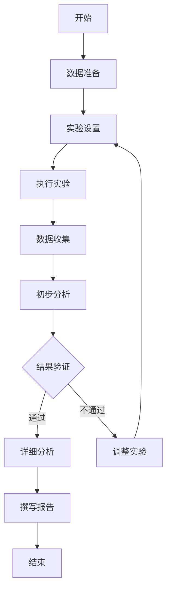

# 实验设计模板

## 实验基本信息
- **实验名称**: [请填写实验名称]
- **对应研究问题**: [关联的研究问题]
- **实验负责人**: [您的姓名]
- **计划开始日期**: [YYYY-MM-DD]
- **预计完成日期**: [YYYY-MM-DD]
- **实验类型**: [验证性/探索性/对比性等]

## 实验目的
### 主要目的
[用一句话描述实验要验证或探索的核心问题]

### 具体目标
1. [目标1：具体、可测量的实验目标]
2. [目标2：具体、可测量的实验目标]
3. [目标3：具体、可测量的实验目标]

## 实验假设
### 研究假设
1. **H1**: [假设描述] - [预期结果]
2. **H2**: [假设描述] - [预期结果]
3. **H3**: [假设描述] - [预期结果]

### 零假设
1. **H0₁**: [与H1对应的零假设]
2. **H0₂**: [与H2对应的零假设]
3. **H0₃**: [与H3对应的零假设]

## 实验设计
### 实验变量
#### 自变量（Independent Variables）
| 变量名称 | 变量类型 | 取值/水平 | 控制方式 |
|----------|----------|-----------|----------|
| [变量1] | [连续/离散] | [取值范围] | [如何控制] |
| [变量2] | [连续/离散] | [取值范围] | [如何控制] |

#### 因变量（Dependent Variables）
| 变量名称 | 测量指标 | 测量方法 | 重要性 |
|----------|----------|----------|--------|
| [变量1] | [指标1, 指标2] | [测量工具] | [高/中/低] |
| [变量2] | [指标1, 指标2] | [测量工具] | [高/中/低] |

#### 控制变量（Control Variables）
| 变量名称 | 控制方法 | 控制理由 |
|----------|----------|----------|
| [变量1] | [如何控制] | [为什么需要控制] |
| [变量2] | [如何控制] | [为什么需要控制] |

### 实验组设计
#### 实验组配置
| 组别 | 名称 | 自变量设置 | 样本量 | 目的 |
|------|------|------------|--------|------|
| A | [组名] | [变量设置] | [n=] | [验证什么] |
| B | [组名] | [变量设置] | [n=] | [验证什么] |
| C | [对照组] | [基准设置] | [n=] | [提供基准] |

#### 实验条件
- **环境条件**: [硬件、软件、网络等环境要求]
- **时间条件**: [实验时长、时间安排等]
- **人员条件**: [操作人员要求、培训需求]

## 方法细节
### 数据收集
#### 数据来源
| 数据类型 | 来源 | 获取方式 | 数据量 | 质量要求 |
|----------|------|----------|--------|----------|
| [训练数据] | [来源描述] | [API/下载/生成] | [数量] | [质量标准] |
| [测试数据] | [来源描述] | [API/下载/生成] | [数量] | [质量标准] |

#### 数据预处理
1. **清洗步骤**: [去重、去噪、标准化等]
2. **特征工程**: [特征提取、选择、转换]
3. **数据分割**: [训练/验证/测试集比例]

### 实验流程
#### 整体流程


#### 详细步骤
1. **步骤1**: [步骤名称]
   - 操作: [具体操作]
   - 输出: [预期产出]
   - 检查点: [质量检查标准]

2. **步骤2**: [步骤名称]
   - 操作: [具体操作]
   - 输出: [预期产出]
   - 检查点: [质量检查标准]

3. **步骤3**: [步骤名称]
   - 操作: [具体操作]
   - 输出: [预期产出]
   - 检查点: [质量检查标准]

### 技术实现
#### 工具和框架
| 工具类型 | 工具名称 | 版本 | 用途 |
|----------|----------|------|------|
| 编程语言 | [Python/R等] | [版本] | [主要用途] |
| 机器学习框架 | [PyTorch/TensorFlow等] | [版本] | [模型实现] |
| 数据分析 | [pandas/numpy等] | [版本] | [数据处理] |
| 可视化 | [matplotlib/seaborn等] | [版本] | [结果展示] |

#### 代码结构
```
📁 code/
├── 📁 data/          # 数据处理代码
├── 📁 models/        # 模型实现代码
├── 📁 experiments/   # 实验运行代码
├── 📁 utils/         # 工具函数
├── config.yaml      # 配置文件
└── main.py         # 主程序
```

## 评估方法
### 评估指标
| 指标名称 | 计算公式 | 解释 | 重要性 |
|----------|----------|------|--------|
| [准确率] | [公式] | [指标含义] | [高/中/低] |
| [F1分数] | [公式] | [指标含义] | [高/中/低] |
| [运行时间] | [测量方法] | [效率指标] | [高/中/低] |

### 统计方法
1. **描述性统计**: [均值、标准差、分布等]
2. **推断性统计**: [t检验、ANOVA、相关性分析等]
3. **可视化方法**: [图表类型、展示方式]

### 显著性水平
- **α水平**: [通常为0.05]
- **统计功效**: [通常为0.8]
- **样本量计算**: [基于效应大小和统计功效]

## 质量控制
### 数据质量
1. **完整性检查**: [检查数据缺失]
2. **一致性检查**: [检查数据格式和范围]
3. **准确性检查**: [验证数据准确性]

### 实验质量
1. **可重复性**: [记录随机种子、环境配置]
2. **一致性**: [确保实验条件一致]
3. **验证性**: [设置验证检查点]

### 结果质量
1. **可靠性**: [多次重复实验]
2. **有效性**: [与理论预期对比]
3. **实用性**: [实际应用价值评估]

## 资源需求
### 计算资源
| 资源类型 | 规格要求 | 数量 | 使用时间 |
|----------|----------|------|----------|
| CPU | [核心数、频率] | [数量] | [时长] |
| GPU | [型号、显存] | [数量] | [时长] |
| 内存 | [容量] | [数量] | [时长] |
| 存储 | [容量、类型] | [数量] | [时长] |

### 软件资源
| 软件名称 | 版本要求 | 许可证 | 获取方式 |
|----------|----------|--------|----------|
| [软件1] | [版本] | [许可证类型] | [下载/购买] |
| [软件2] | [版本] | [许可证类型] | [下载/购买] |

### 人力资源
| 角色 | 任务 | 时间投入 | 技能要求 |
|------|------|----------|----------|
| [实验员] | [实验执行] | [小时数] | [技能要求] |
| [分析员] | [数据分析] | [小时数] | [技能要求] |

## 时间计划
### 详细时间表
| 阶段 | 开始日期 | 结束日期 | 主要任务 | 负责人 |
|------|----------|----------|----------|--------|
| 准备阶段 | [日期] | [日期] | [任务描述] | [姓名] |
| 执行阶段 | [日期] | [日期] | [任务描述] | [姓名] |
| 分析阶段 | [日期] | [日期] | [任务描述] | [姓名] |
| 报告阶段 | [日期] | [日期] | [任务描述] | [姓名] |

### 里程碑
1. **M1**: [里程碑名称] ([日期]) - [完成标准]
2. **M2**: [里程碑名称] ([日期]) - [完成标准]
3. **M3**: [里程碑名称] ([日期]) - [完成标准]

## 风险评估与应对
### 技术风险
| 风险描述 | 概率 | 影响 | 应对策略 |
|----------|------|------|----------|
| [算法不收敛] | [高/中/低] | [高/中/低] | [调整超参数、更换算法] |
| [数据质量问题] | [高/中/低] | [高/中/低] | [数据清洗、增加数据源] |

### 资源风险
| 风险描述 | 概率 | 影响 | 应对策略 |
|----------|------|------|----------|
| [计算资源不足] | [高/中/低] | [高/中/低] | [优化代码、使用云资源] |
| [时间不足] | [高/中/低] | [高/中/低] | [调整范围、优先核心任务] |

### 其他风险
| 风险描述 | 概率 | 影响 | 应对策略 |
|----------|------|------|----------|
| [人员变动] | [高/中/低] | [高/中/低] | [文档化、知识共享] |
| [外部依赖] | [高/中/低] | [高/中/低] | [准备备用方案] |

## 伦理考虑
### 数据伦理
1. **隐私保护**: [如何处理个人数据]
2. **数据安全**: [如何保护数据安全]
3. **使用权限**: [数据使用权限和限制]

### 研究伦理
1. **透明度**: [如何确保研究过程透明]
2. **可重复性**: [如何确保结果可重复]
3. **利益冲突**: [是否存在利益冲突]

## 交付物
### 主要交付物
1. [实验代码和配置]
2. [原始数据和结果]
3. [分析报告和可视化]

### 辅助交付物
1. [实验日志和记录]
2. [技术文档]
3. [演示材料]

## 审批记录
- **设计自评**: [ ] 实验设计完整合理
- **同行评审**: [ ] 已获得反馈和建议
- **资源确认**: [ ] 资源需求已确认
- **伦理审查**: [ ] 符合伦理要求
- **最终批准**: [ ] 可以开始实验

---
**使用提示**:
1. 实验设计应具体、可操作
2. 考虑所有可能的变量和影响因素
3. 设计足够的控制组和重复
4. 提前规划数据收集和分析方法
5. 记录所有实验细节以便重复