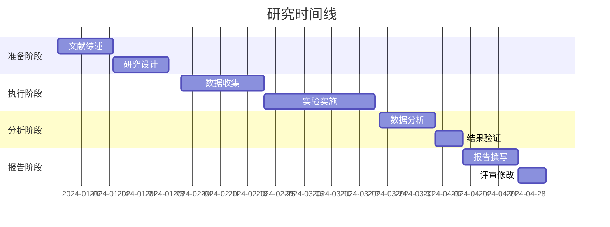

# 研究报告模板

## 报告基本信息
- **报告标题**: [研究项目名称]
- **报告编号**: [REP-YYYY-MM-001]
- **研究期间**: [开始日期] 至 [结束日期]
- **报告日期**: [YYYY-MM-DD]
- **报告版本**: [1.0]
- **保密级别**: [公开/内部/机密]

## 执行摘要
### 核心发现
1. **[最重要发现1]**: [简要描述，包括关键数据和意义]
2. **[最重要发现2]**: [简要描述，包括关键数据和意义]
3. **[最重要发现3]**: [简要描述，包括关键数据和意义]

### 主要结论
- **结论1**: [基于证据的核心结论]
- **结论2**: [基于证据的核心结论]
- **结论3**: [基于证据的核心结论]

### 关键建议
- **建议1**: [具体、可操作的建议]
- **建议2**: [具体、可操作的建议]
- **建议3**: [具体、可操作的建议]

### 研究价值
- **理论贡献**: [对学科理论的贡献]
- **实践价值**: [实际应用价值]
- **创新点**: [研究方法或技术的创新]

## 1. 研究背景与意义
### 1.1 问题背景
[描述研究问题的现实背景和重要性]

### 1.2 研究现状
[综述相关领域的研究进展和空白]

### 1.3 研究意义
#### 理论意义
1. [对理论发展的贡献]
2. [方法论的创新]
3. [知识体系的完善]

#### 实践意义
1. [实际应用价值]
2. [技术推广潜力]
3. [社会或经济效益]

## 2. 研究目标与问题
### 2.1 研究目标
#### 主要目标
1. [目标1：具体、可衡量]
2. [目标2：具体、可衡量]
3. [目标3：具体、可衡量]

#### 次要目标
1. [探索性目标]
2. [技术验证目标]

### 2.2 研究问题
1. **RQ1**: [研究问题1]
2. **RQ2**: [研究问题2]
3. **RQ3**: [研究问题3]

### 2.3 研究范围
- **包含范围**: [明确研究包含的内容]
- **排除范围**: [明确不研究的内容]
- **研究边界**: [研究的限制条件]

## 3. 研究方法
### 3.1 研究设计
#### 整体设计
[描述研究的整体设计思路和方法论]

#### 研究类型
- [ ] 探索性研究
- [ ] 描述性研究
- [ ] 解释性研究
- [ ] 实验研究
- [ ] 案例研究

### 3.2 数据收集
#### 数据来源
| 数据类型 | 来源 | 获取方式 | 数据量 | 质量评估 |
|----------|------|----------|--------|----------|
| [类型1] | [来源] | [方法] | [数量] | [质量] |
| [类型2] | [来源] | [方法] | [数量] | [质量] |

#### 数据预处理
1. **数据清洗**: [去重、去噪、处理缺失值]
2. **特征工程**: [特征提取、选择、转换]
3. **数据分割**: [训练/验证/测试集划分]

### 3.3 实验设计
#### 实验变量
- **自变量**: [变量列表]
- **因变量**: [变量列表]
- **控制变量**: [变量列表]

#### 实验组设计
| 组别 | 名称 | 设置 | 样本量 | 目的 |
|------|------|------|--------|------|
| A | [组名] | [设置] | [n=] | [目的] |
| B | [组名] | [设置] | [n=] | [目的] |
| C | [对照组] | [设置] | [n=] | [基准] |

### 3.4 分析框架
#### 分析方法
1. **描述性分析**: [方法描述]
2. **推断性分析**: [统计检验方法]
3. **可视化分析**: [图表类型和方法]

#### 评估指标
| 指标 | 计算公式 | 解释 | 重要性 |
|------|----------|------|--------|
| [指标1] | [公式] | [含义] | [高/中/低] |
| [指标2] | [公式] | [含义] | [高/中/低] |

## 4. 研究过程
### 4.1 时间线


### 4.2 关键里程碑
| 里程碑 | 日期 | 完成标准 | 状态 |
|--------|------|----------|------|
| M1: 研究设计完成 | [日期] | [标准] | [完成/进行中] |
| M2: 数据收集完成 | [日期] | [标准] | [完成/进行中] |
| M3: 实验完成 | [日期] | [标准] | [完成/进行中] |
| M4: 分析完成 | [日期] | [标准] | [完成/进行中] |

### 4.3 资源使用
#### 人力资源
| 角色 | 姓名 | 投入时间 | 主要贡献 |
|------|------|----------|----------|
| [角色1] | [姓名] | [小时] | [贡献] |
| [角色2] | [姓名] | [小时] | [贡献] |

#### 计算资源
| 资源类型 | 规格 | 使用时长 | 成本 |
|----------|------|----------|------|
| [CPU] | [规格] | [小时] | [成本] |
| [GPU] | [规格] | [小时] | [成本] |
| [存储] | [容量] | [时长] | [成本] |

## 5. 研究结果
### 5.1 主要结果
#### 核心指标结果
| 指标 | 实验组A | 实验组B | 对照组 | 改善幅度 |
|------|---------|---------|--------|----------|
| [指标1] | [数值] | [数值] | [数值] | [百分比] |
| [指标2] | [数值] | [数值] | [数值] | [百分比] |
| [指标3] | [数值] | [数值] | [数值] | [百分比] |

#### 假设检验结果
| 假设 | 检验方法 | p值 | 效应大小 | 结论 |
|------|----------|-----|----------|------|
| H1 | [方法] | [值] | [大小] | [接受/拒绝] |
| H2 | [方法] | [值] | [大小] | [接受/拒绝] |
| H3 | [方法] | [值] | [大小] | [接受/拒绝] |

### 5.2 深入分析结果
#### 影响因素分析
[分析各因素对结果的影响]

#### 交互效应分析
[分析变量间的交互作用]

#### 稳健性检验
[验证结果的稳健性和可靠性]

### 5.3 可视化展示
#### 关键图表
1. **图表1**: [图表名称]
   - 展示内容: [描述]
   - 关键发现: [从图表得出的结论]
   - 位置: [图表文件路径]

2. **图表2**: [图表名称]
   - 展示内容: [描述]
   - 关键发现: [从图表得出的结论]
   - 位置: [图表文件路径]

## 6. 讨论与分析
### 6.1 结果解释
#### 与预期对比
| 预期结果 | 实际结果 | 一致性 | 差异解释 |
|----------|----------|--------|----------|
| [预期1] | [结果1] | [一致/不一致] | [解释] |
| [预期2] | [结果2] | [一致/不一致] | [解释] |

#### 与相关工作对比
[将结果与现有研究进行对比分析]

### 6.2 理论贡献
1. **贡献1**: [对理论的贡献]
   - 证据: [支持证据]
   - 意义: [理论意义]

2. **贡献2**: [对理论的贡献]
   - 证据: [支持证据]
   - 意义: [理论意义]

### 6.3 实践启示
#### 技术应用
1. **应用场景1**: [具体应用场景]
   - 适用条件: [应用条件]
   - 预期效果: [应用效果]

2. **应用场景2**: [具体应用场景]
   - 适用条件: [应用条件]
   - 预期效果: [应用效果]

#### 最佳实践
[基于研究结果总结的最佳实践]

### 6.4 局限性分析
#### 方法局限性
1. **局限1**: [描述]
   - 影响: [对结果的影响]
   - 改进方向: [改进建议]

2. **局限2**: [描述]
   - 影响: [对结果的影响]
   - 改进方向: [改进建议]

#### 数据局限性
[分析数据方面的局限性]

#### 实验局限性
[分析实验设计方面的局限性]

## 7. 结论与建议
### 7.1 主要结论
1. **结论1**: [基于证据的核心结论]
   - 支持度: [证据强度]
   - 重要性: [结论重要性]

2. **结论2**: [基于证据的核心结论]
   - 支持度: [证据强度]
   - 重要性: [结论重要性]

3. **结论3**: [基于证据的核心结论]
   - 支持度: [证据强度]
   - 重要性: [结论重要性]

### 7.2 实践建议
#### 技术实施建议
1. **建议1**: [具体技术建议]
   - 实施步骤: [如何实施]
   - 预期效果: [预期改进]

2. **建议2**: [具体技术建议]
   - 实施步骤: [如何实施]
   - 预期效果: [预期改进]

#### 管理决策建议
[针对管理层的决策建议]

### 7.3 后续研究建议
1. **研究方向1**: [值得深入研究的方向]
   - 研究价值: [潜在贡献]
   - 研究方法: [建议方法]

2. **研究方向2**: [值得深入研究的方向]
   - 研究价值: [潜在贡献]
   - 研究方法: [建议方法]

## 8. 参考文献
### 8.1 关键文献
1. [作者]. (年份). [文章标题]. [期刊名称], [卷(期)], [页码]. DOI: [DOI号]
2. [作者]. (年份). [文章标题]. [会议名称], [页码]. DOI: [DOI号]
3. [作者]. (年份). [书籍名称]. [出版社].

### 8.2 相关资源
- [数据集链接]
- [代码仓库链接]
- [工具文档链接]

## 9. 附录
### 9.1 补充材料
#### 详细数据表
| 表格名称 | 内容描述 | 文件位置 |
|----------|----------|----------|
| [表1] | [描述] | [路径] |
| [表2] | [描述] | [路径] |

#### 额外分析
[补充的分析内容和结果]

### 9.2 技术文档
#### 代码说明
```python
# 主要代码文件说明
main_script.py: [主要功能]
utils.py: [工具函数]
config.yaml: [配置文件]
```

#### 环境配置
```bash
# 运行环境要求
Python版本: [版本]
依赖包: [包列表]
硬件要求: [要求描述]
```

### 9.3 原始数据
#### 数据文件
| 文件名称 | 格式 | 大小 | 描述 |
|----------|------|------|------|
| [文件1] | [格式] | [大小] | [描述] |
| [文件2] | [格式] | [大小] | [描述] |

#### 数据访问
- **原始数据位置**: [存储路径]
- **数据处理脚本**: [脚本路径]
- **数据使用说明**: [说明文档]

## 10. 质量保证
### 10.1 研究质量评估
#### 内部有效性
- [ ] 实验设计合理
- [ ] 变量控制充分
- [ ] 测量工具可靠
- [ ] 数据分析正确

#### 外部有效性
- [ ] 结果可推广
- [ ] 样本代表性
- [ ] 环境适应性

#### 可靠性
- [ ] 过程可重复
- [ ] 结果可验证
- [ ] 文档完整

### 10.2 伦理审查
#### 研究伦理
- [ ] 参与者知情同意
- [ ] 数据隐私保护
- [ ] 利益冲突声明
- [ ] 研究过程透明

#### 数据伦理
- [ ] 数据使用合规
- [ ] 数据安全保护
- [ ] 数据共享规范

### 10.3 同行评审
#### 评审记录
| 评审人 | 单位 | 评审日期 | 主要意见 | 采纳情况 |
|--------|------|----------|----------|----------|
| [姓名] | [单位] | [日期] | [意见] | [采纳/部分采纳/未采纳] |
| [姓名] | [单位] | [日期] | [意见] | [采纳/部分采纳/未采纳] |

#### 修改记录
[根据评审意见的修改情况]

## 11. 致谢
### 11.1 感谢对象
1. **指导老师/导师**: [姓名，单位，贡献]
2. **合作研究者**: [姓名，单位，贡献]
3. **技术支持人员**: [姓名，单位，贡献]
4. **数据提供者**: [姓名/机构，贡献]
5. **资金支持**: [基金名称，编号]

### 11.2 机构支持
[感谢提供支持的机构和单位]

## 12. 作者贡献声明
### 12.1 作者列表
| 姓名 | 单位 | 邮箱 | ORCID |
|------|------|------|-------|
| [姓名1] | [单位] | [邮箱] | [ORCID] |
| [姓名2] | [单位] | [邮箱] | [ORCID] |

### 12.2 贡献说明
| 作者 | 概念提出 | 研究设计 | 数据收集 | 实验实施 | 数据分析 | 论文撰写 | 经费获取 |
|------|----------|----------|----------|----------|----------|----------|----------|
| [姓名1] | [程度] | [程度] | [程度] | [程度] | [程度] | [程度] | [程度] |
| [姓名2] | [程度] | [程度] | [程度] | [程度] | [程度] | [程度] | [程度] |

**程度说明**: 主要贡献(●)、重要贡献(○)、一般贡献(△)、无贡献(-)

## 13. 利益冲突声明
### 13.1 潜在冲突
[声明可能存在的利益冲突]

### 13.2 处理措施
[说明如何处理利益冲突]

## 14. 数据可用性声明
### 14.1 数据共享政策
[说明数据共享的政策和条件]

### 14.2 数据获取方式
[提供数据获取的途径和方法]

## 15. 版本历史
| 版本 | 日期 | 修改内容 | 修改人 | 审核人 |
|------|------|----------|--------|--------|
| 1.0 | [YYYY-MM-DD] | 初始版本 | [姓名] | [姓名] |
| 1.1 | [YYYY-MM-DD] | 补充分析 | [姓名] | [姓名] |
| 1.2 | [YYYY-MM-DD] | 根据评审修改 | [姓名] | [姓名] |

## 16. 审批记录
### 16.1 内部审批
| 审批环节 | 审批人 | 审批日期 | 审批意见 | 状态 |
|----------|--------|----------|----------|------|
| 技术审核 | [姓名] | [日期] | [意见] | [通过] |
| 质量审核 | [姓名] | [日期] | [意见] | [通过] |
| 最终批准 | [姓名] | [日期] | [意见] | [通过] |

### 16.2 外部审批
[如有外部审批，记录在此]

---
**报告使用说明**:
1. 本报告为研究项目的正式文档
2. 引用本报告时请注明出处
3. 报告内容仅供参考，实际应用需结合具体情况
4. 如有疑问，请联系报告负责人

**联系方式**:
- 报告负责人: [姓名]
- 电子邮箱: [邮箱]
- 联系电话: [电话]
- 单位地址: [地址]